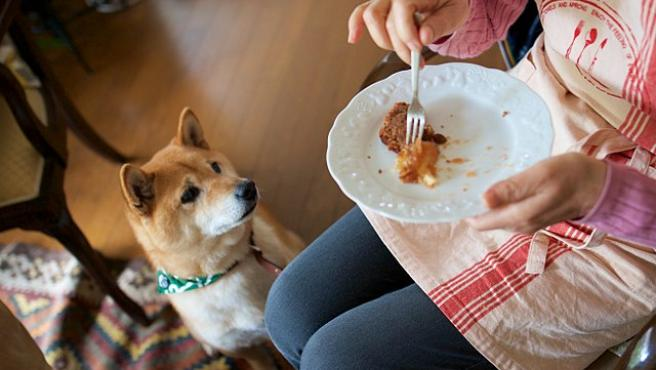

Los perros son capaces de saber cuándo estás eligiendo no darles de comer. Es la conclusión de un estudio llevado a cabo en Alemania, que ha descubierto que los perros diferencian **cuándo les negamos comida** de manera intencionada.

Tal y como recoge [Gizmodo](https://es.gizmodo.com/los-perros-pueden-saber-cuando-les-estas-ocultando-comi-1847604024), esta conclusión podría significar que los perros poseen un aspecto de la cognición se ha considerado exclusivo de los humanos (y algunas aves y grandes primates): la capacidad de **reconocer el funcionamiento interno de otros**.

La llamada teoría de la mente, en psicología, hace referencia a la capacidad que tenemos de reconocer que los que nos rodean también tienen sus pensamientos y pueden diferir de los nuestros. Esto nos permite **ser empáticos con los demás** y esta capacidad se adquiere cuando somos niños.

## Así fue el experimento

Se analizaron 51 perros, que fueron separados de sus compañeros humanos por una barrera de cristal. Esta barrera **tenía una abertura** por la que los humanos podían pasar la comida, lo que se le mostró a los perros en las pruebas de calentamiento.

Luego, los investigadores establecieron tres condiciones para todos los perros: una en la que los humanos estaban a punto de dar comida a través de la abertura, pero cambiaban de opinión y la colocaban deliberadamente frente a ellos; en la otra condición, **la comida estaba a punto de pasar a través del espacio**, pero luego se dejaba caer antes de que pudiera alcanzar al perro; y en la tercera condición, las personas intentaron dar comida a sus perros, pero se vieron disuadidas por el bloqueo de la abertura.

Los perros respondían de manera diferente a estas tres acciones. Cuando sus dueños '**cambiaban de opinión**' y no les daban comida, los perros tardaron más en acercarse a la barrera que en los otros dos supuestos. También se sentaban o se acostaban con más frecuencia y no movían tanto la cola, unos comportamientos que podrían responder a su deseo de apaciguar a los humanos.

> "Tenemos que tener cuidado aquí. Lo que podemos decir, sin embargo, es que tenemos la primera evidencia de que no solo los chimpancés y las aves, sino también los perros podrían tener esta capacidad muy básica, pero sustancial que es parte de la teoría de la mente", dice **Britta Schünemann**.